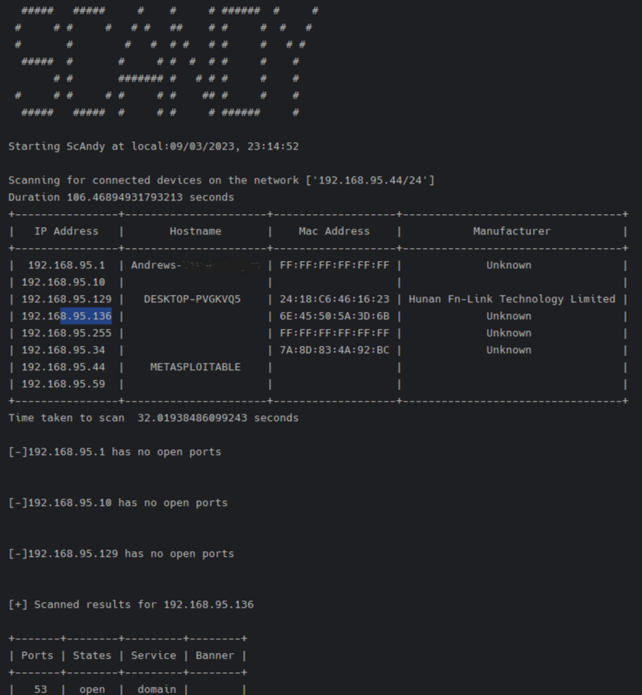
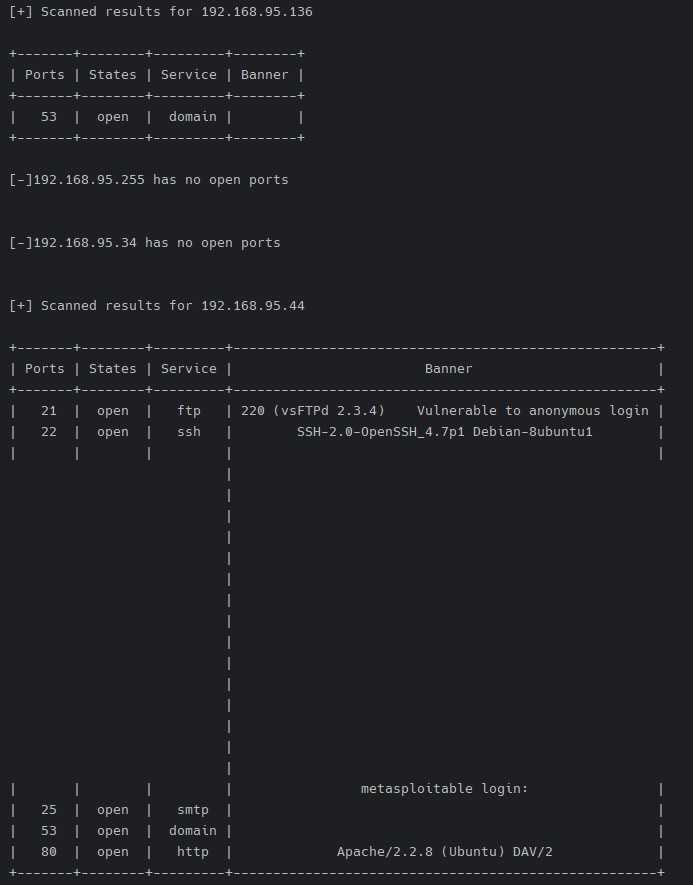
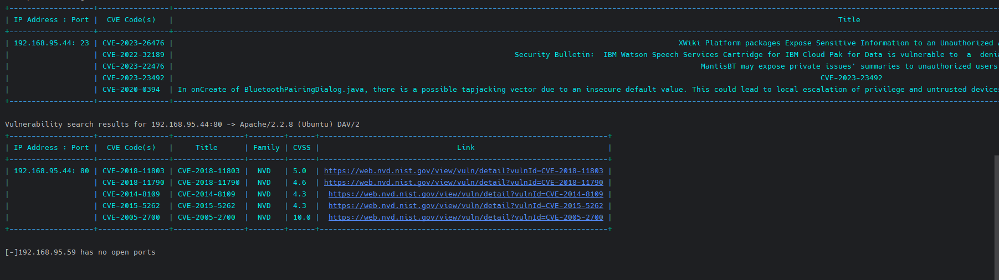
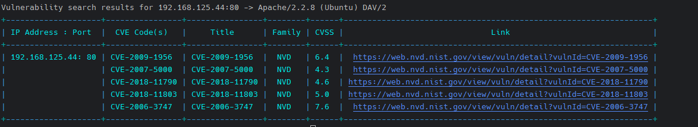

<pre>
  #####   #####     #    #     # ######  #     #
 #     # #     #   # #   ##    # #     #  #   #
 #       #        #   #  # #   # #     #   # #
  #####  #       #     # #  #  # #     #    #
       # #       ####### #   # # #     #    #
 #     # #     # #     # #    ## #     #    #
  #####   #####  #     # #     # ######     #
</pre>

Scandy is a network vulnerability scanner built with python 
Features
<ul>
<li>Scan network for connected devices. command scandy -t 192.168.95.1/24</li>
<li>Scan for open ports</li>

<li>Search for existing CVE for open ports using <a href="https://vulners.com/">Vulners</a> api</li>
</ul>

|   Commands    	   |     Description         	      |
|:-----------------:|:------------------------------:|
| -t or --target 	  |    Target network ip      	    |
|  -p or --port  	  |    port(s) to scan       	     |
| -th or --thread 	 | Number of thread. Default 50 	 |
| -v or --verbose 	 |  Print all closed ports    	   |

Usage examples:
python scandy.py -t 10.0.2.5 -p 20 21 23 22 80 1000
  This will scan port 20,21,22,23,80,1000 on target 10.0.2.5

python scandy.py -t 10.0.2.5/24 
This will scan first 1000 ports of all devices that can be reached on
the network.

python scandy.py -h 10.0.2.5/16 -pr 1 100 -th 20
 
This will scan port of range 1 to 100 of all devices on 10.0.2.5/16 with 20 threads

 
Some results  
 
 
 
